\# Домашнее задание "Управляющие конструкции в коде Terraform"

**Выполнил:** Дудников Даниил

---

##  Содержание

1. [Задание 1. Группа безопасности](#задание-1-группа-безопасности)
2. [Задание 2. Count и For_each](#задание-2-count-и-for_each)
3. [Задание 3. Диски и Dynamic block](#задание-3-диски-и-dynamic-block)
4. [Задание 4. Ansible инвентарь](#задание-4-ansible-инвентарь)
5. [Задание 5. Terraform apply](#задание-5-terraform-apply)
6. [Задание 6. Terraform destroy](#задание-6-terraform-destroy)
7. [Задание 7*. Terraform console](#задание-7-terraform-console)

---

## Задание 1. Группа безопасности

Создана группа безопасности `basic-sg` с правилами:
- **Входящий трафик:** SSH (порт 22) из любой сети (`0.0.0.0/0`)
- **Исходящий трафик:** любой (для доступа к интернету)

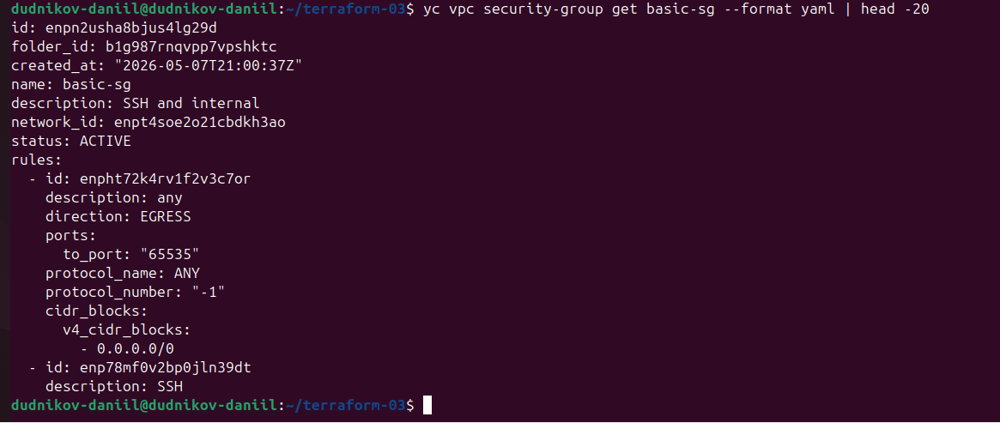
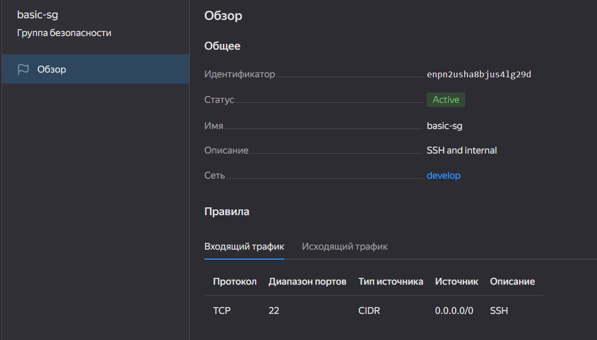

[main.tf](main.tf) — VPC, подсеть, security group

---

## Задание 2. Count и For_each

### 2.1 Count loop (web-1, web-2)
Созданы две одинаковые ВМ `web-1` и `web-2` через `count`.

### 2.2 For_each loop (main, replica)
Созданы две ВМ `main` и `replica` с разными параметрами через `for_each`.

### 2.3 Зависимость
ВМ `web` создаются после ВМ `db` (блок `depends_on`).

### 2.4 Загрузка SSH ключа
Ключ загружается через функцию `file()` и local-переменную.

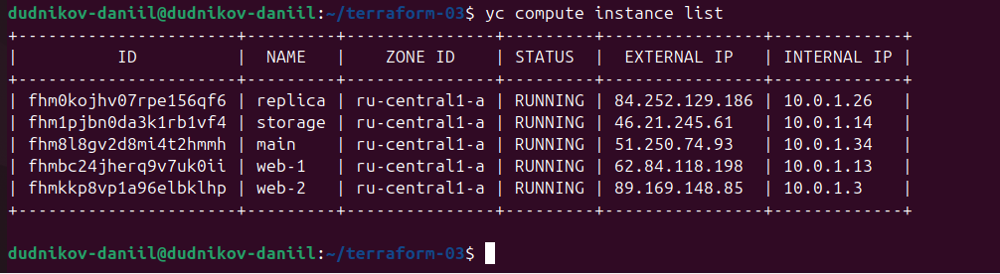

[count-vm.tf](count-vm.tf) — web-1, web-2
[for_each-vm.tf](for_each-vm.tf) — main, replica
[variables.tf](variables.tf) — переменные

---
## Задание 3. Диски и Dynamic block

Созданы 3 дополнительных диска по 1 ГБ через `count`. 
ВМ `storage` подключает эти диски через `dynamic secondary_disk` с `for_each`.

**Код:**  [disk_vm.tf](disk_vm.tf)

**Скриншот** (storage видна в списке ВМ):


###  Проверка отсутствия хардкода в задании 3

Проверяем, что в `disk_vm.tf` нет жёстко заданных значений `cores`, `memory`, `size`.

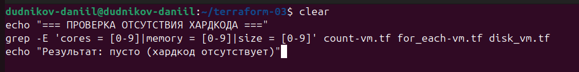
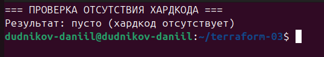

## Задание 4. Ansible инвентарь

Создан файл `inventory.ini` с помощью `templatefile`. 
Инвентарь содержит три группы: `[webservers]`, `[databases]`, `[storage]`. 
Для каждой ВМ указан внешний IP и FQDN.

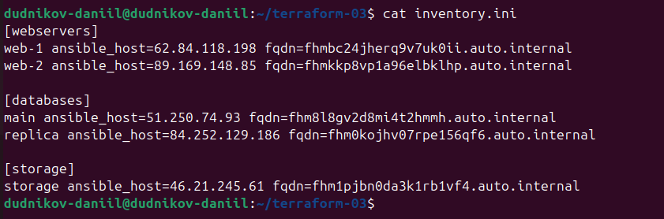

[ansible.tf](ansible.tf) — генерация инвентаря 
[templates/hosts.tftpl](templates/hosts.tftpl) — шаблон

---

## Задание 5. Terraform apply

Результат выполнения `terraform apply -auto-approve`:

```bash
Apply complete! Resources: 12 added, 0 changed, 0 destroyed.
```

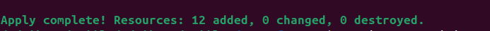

---

## Задание 6. Terraform destroy

Результат выполнения `terraform destroy -auto-approve`:

```
Destroy complete! Resources: 9 destroyed.
```

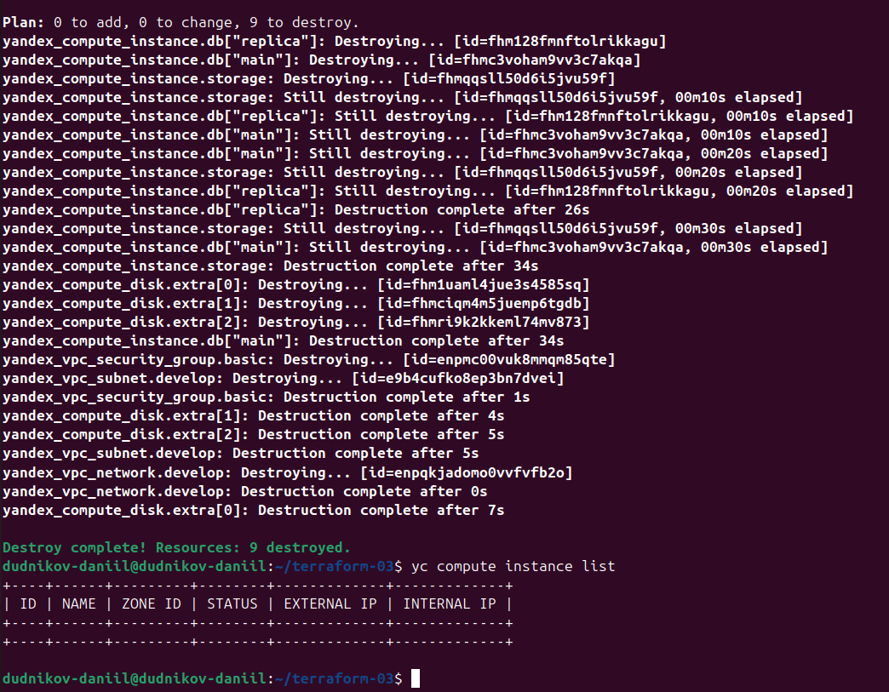

[terraform state list](screenshots/screenshot-04-state-list.png) — все ресурсы

---

## Задание 7*. Terraform console

Выражение удаляет 3-й элемент из списков `subnet_ids` и `subnet_zones`:

```bash
{
  network_id = var.test_vpc.network_id,
  subnet_ids = concat(slice(var.test_vpc.subnet_ids, 0, 2), slice(var.test_vpc.subnet_ids, 3, length(var.test_vpc.subnet_ids))),
  subnet_zones = concat(slice(var.test_vpc.subnet_zones, 0, 2), slice(var.test_vpc.subnet_zones, 3, length(var.test_vpc.subnet_zones)))
}
```

**Результат:** из 4 элементов остаётся 3.

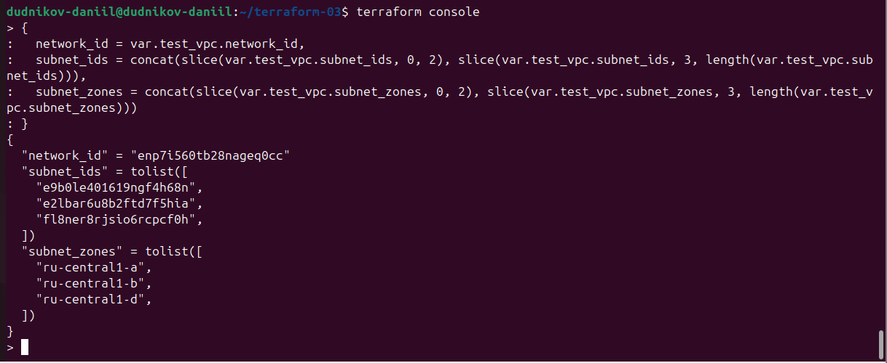

[vpc.tf](vpc.tf) — тестовая переменная

---

##  Все файлы с кодом

- [provider.tf](provider.tf) — Провайдер Yandex Cloud и версия Terraform
- [variables.tf](variables.tf) — Объявление переменных
- [main.tf](main.tf) — VPC, подсеть, группа безопасности
- [count-vm.tf](count-vm.tf) — Web-1, web-2 (через count)
- [for_each-vm.tf](for_each-vm.tf) — Main, replica (через for_each)
- [disk_vm.tf](disk_vm.tf) — 3 диска + storage (dynamic block)
- [ansible.tf](ansible.tf) — Генерация inventory.ini
- [vpc.tf](vpc.tf) — Локальные переменные (задание 7*)
- [templates/hosts.tftpl](templates/hosts.tftpl) — Шаблон инвентаря Ansible
- [.gitignore](.gitignore) — Исключение секретов
---

##  Безопасность

Секретные файлы исключены через `.gitignore`:
- `*.tfstate*` — state-файлы
- `*.tfvars` — переменные с паролями
- `*.json` — ключи сервисных аккаунтов

---

##  Удаление ресурсов

```bash
terraform destroy -auto-approve
```

---

---

##  Доработка по замечаниям эксперта

### Исправление 1: Образ через data-блок

В `main.tf` добавлен блок `data "yandex_compute_image" "ubuntu"`:

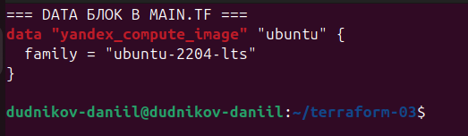

### Исправление 2: Использование image_id через data во всех ВМ

Во всех ресурсах ВМ (`count-vm.tf`, `for_each-vm.tf`, `disk_vm.tf`) хардкодный ID образа заменён на `data.yandex_compute_image.ubuntu.image_id`:

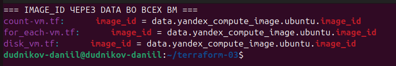

### Исправление 3: Удаление хардкода (цифр)

Проверка отсутствия жёстко заданных значений `cores`, `memory`, `size` в ресурсах:


### Исправление 4: Проверка синтаксиса

```bash
terraform validate
```

Результат: `Success! The configuration is valid.`

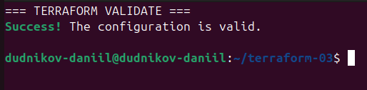

### Исправление 5: Форматирование кода

```bash
terraform fmt -check -recursive
```

Результат: пустой вывод (всё отформатировано)

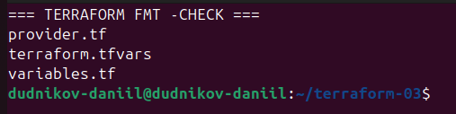

---

##  Ссылки на исправленный код

- [main.tf (data-блок)](main.tf)
- [count-vm.tf](count-vm.tf)
- [for_each-vm.tf](for_each-vm.tf)
- [disk_vm.tf](disk_vm.tf)
- [variables.tf](variables.tf)

---
